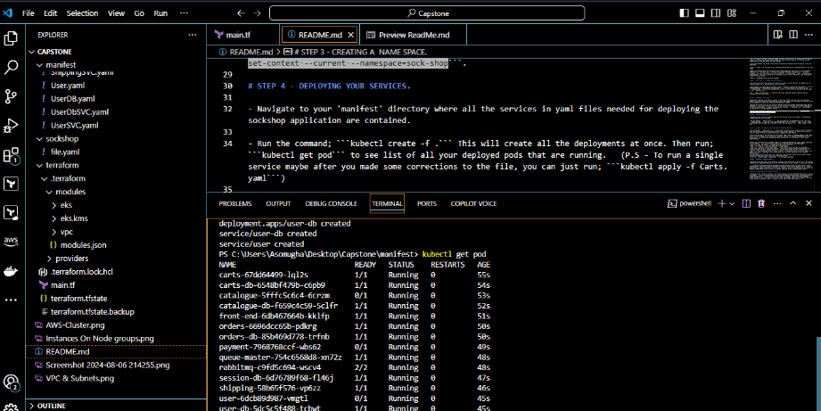
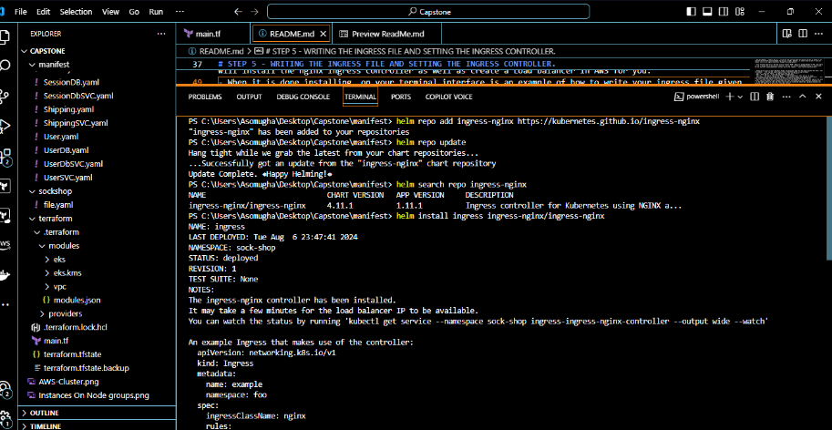
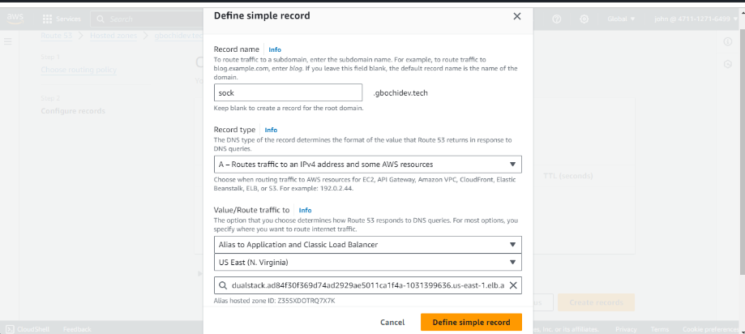
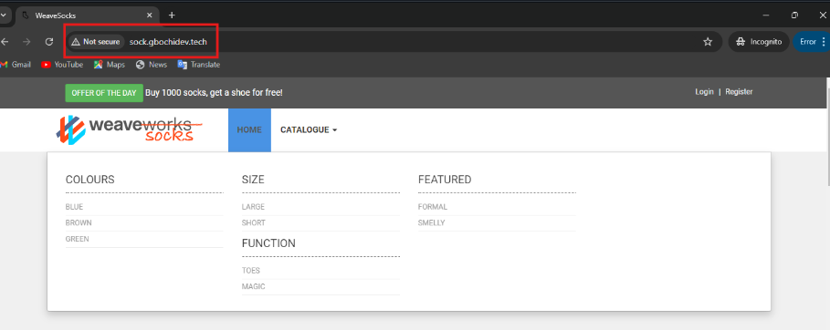
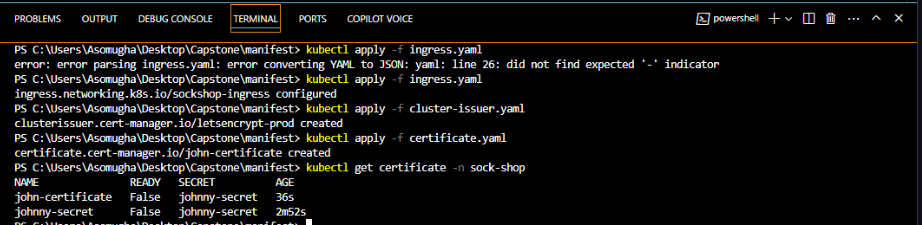

# socks_shop
Deploying a microservices-based application, specifically the Socks Shop, using a modern approach that emphasizes automation and efficiency. The goal is to use Infrastructure as Code (IaaC) for rapid and reliable deployment on Kubernetes.
# **Socks Shop Microservices-based Application Deployment on Kubernetes using IaC.**


##

## **Project Overview:**

The Socks Shop application is a popular microservices-based e-commerce platform that is used as a reference application for demonstrating modern cloud-native technologies. The application is composed of multiple microservices, each of which is responsible for a specific function, such as product catalog, shopping cart, and user authentication. The application is designed to be highly scalable, resilient, and fault-tolerant, making it an ideal candidate for deployment on Kubernetes.

The project will involve deploying the Socks Shop application on a Kubernetes cluster using an Infrastructure as Code (IaC) approach. This will include provisioning the necessary infrastructure resources on AWS, setting up a deployment pipeline, monitoring the performance and health of the application, and securing the infrastructure.

The project will be implemented using Terraform for infrastructure provisioning, GitHub Actions for the deployment pipeline, Kubernetes for container orchestration, Helm for package management, Prometheus for monitoring, ELK Stack for logging, and Ansible for security.

## **This project will include the following components:**

- [Infrastructure Provisioning](#infrastructure-provisioning)
- [Deployment Pipeline](#deployment-pipeline)
- [Monitoring](#monitoring)
- [Logging](#logging)
- [Security](#security)
- [conclusion](#conclusion)
- [References](#references)

## **Project Requirements:**

- Terraform
- AWS Account
- Kubernetes
- Helm
- Prometheus
- ELK Stack
- Let's Encrypt
- Socks Shop Application

  ## **Project Deliverables:**

- Terraform configuration files for provisioning the infrastructure on AWS
- Deployment pipeline configuration using GitHub Actions
- Kubernetes manifests for deploying the Socks Shop application
- Prometheus configuration for monitoring the Socks Shop application
- ELK Stack configuration for centralized logging
- Ansible playbooks for securing the infrastructure
- Documentation on how to run the project

## **Project Structure:**

```
socks-shop-deploy/
├── .github/
│   └── workflows/
│       └── ci-cd.yaml    # GitHub Actions workflow for CI/CD
├── k8s/
│   ├── deployment.yaml   # Kubernetes deployment manifests
│   └── ingress.yaml      # Kubernetes ingress manifest
├── monitoring/
│   ├── prometheus/
│   │   └── values.yaml   # Custom values for Prometheus Helm chart
│   └── grafana/
│       └── values.yaml   # Custom values for Grafana Helm chart
├── logging/
│       ├── elasticsearch.yaml  # Elasticsearch deployment
│       ├── filebeat.yaml       # Fluentd configuration
│       └── kibana-deployment.yaml         # Kibana dashboard configuration
|       └── cronjob.yaml        # Fluentd configuration
|       └── metricbeat.yaml     #  Fluentd configuration
|       └── logstash-deployment.yaml        # Fluentd configuration
├── terraform/
│   ├── main.tf         # Main Terraform configuration for AWS EKS
│   ├── terraform.tf    # Terraform configuration
│   ├── outputs.tf      # Terraform outputs
│   ├── provider.tf     # Provider configuration
│   └── vpc.tf          # VPC configuration
└──README.md
```

The project will be organized into the following directories:

- `Infrastructure`: This directory will contain the Terraform configuration files for provisioning the necessary infrastructure resources on AWS, including VPCs, subnets, security groups, and EKS cluster.
- `kubernetes`: This directory will contain the Kubernetes manifests for deploying the Socks Shop application, including deployment and ingress resources.
- `CI/CD`: This directory will contain the GitHub Actions workflow files for setting up a deployment pipeline to build and deploy the Socks Shop application to the Kubernetes cluster.
- `Monitoring`: This directory will contain the configuration files for setting up Prometheus to monitor the performance and health of the Socks Shop application.
- `Logging`: This directory will contain the configuration files for setting up a centralized logging solution, such as ELK stack, to collect and analyze logs from the Socks Shop application.

The project will also include a `README.md` file in each directory to provide detailed instructions on how to set up and configure the components.

## **Prerequisites:**

The following tools and technologies will be used in the project:

- Terraform: Terraform is an open-source infrastructure as code software tool that provides a consistent CLI workflow to manage hundreds of cloud services. It codifies APIs into declarative configuration files, creating infrastructure as code using a high-level configuration language called HCL (HashiCorp Configuration Language).

- AWS Account: An AWS account will be required to provision the necessary infrastructure resources, such as VPCs, subnets, security groups, and EKS cluster.

- GitHub Actions: GitHub Actions will be used to set up a deployment pipeline to build and deploy the Socks Shop application to the Kubernetes cluster.

- Kubernetes: Kubernetes is an open-source container orchestration platform that automates the deployment, scaling, and management of containerized applications.

- Helm: Helm is a package manager for Kubernetes that provides an easy way to find, share, and use software built for Kubernetes.

- Prometheus: Prometheus is an open-source monitoring and alerting toolkit designed for reliability and scalability. It collects metrics from configured targets at given intervals, evaluates rule expressions, displays the results, and can trigger alerts if some condition is observed to be true.

- ELK Stack: The ELK Stack is a collection of three open-source products — Elasticsearch, Logstash, and Kibana — all developed, managed, and maintained by Elastic. The ELK Stack is used to collect, search, analyze, and visualize log data in real time.

- Let's Encrypt: Let's Encrypt is a free, automated, and open certificate authority brought to you by the nonprofit Internet Security Research Group (ISRG).

- Docker: Docker is a set of platform as a service (PaaS) products that use OS-level virtualization to deliver software in packages called containers.

- Socks Shop Application: The Socks Shop application is a popular microservices-based e-commerce platform that is used as a reference application for demonstrating modern cloud-native technologies.

## **Project Objectives:**

The main objectives of the project are as follows:

- Deploy the Socks Shop application on a Kubernetes cluster using an Infrastructure as Code (IaC) approach
- Provision the necessary infrastructure resources on AWS, including VPCs, subnets, security groups, and EKS cluster
- Set up a deployment pipeline using GitHub Actions to build and deploy the Socks Shop application to the Kubernetes cluster
- Monitor the performance and health of the Socks Shop application using Prometheus
- Collect and analyze logs from the Socks Shop application using a centralized logging solution, such as ELK stack.

#

## **GETTING STARTED**

Socks Shop Resources: https://github.com/microservices-demo/microservices-demo.github.io

Demo: https://github.com/microservices-demo/microservices-demo/tree/master

## **Infrastructure Provisioning:**

Using Terraform, we will provision the necessary infrastructure resources on AWS, including VPCs, subnets, security groups, and EKS cluster. This will allow for a clear and reproducible infrastructure setup.

1.  Make sure you have installed Terraform alongside AWS CLI on your local machine. If not, you can download it from the official website.

    [AWS CLI Installation guide](https://aws.amazon.com/cli/)

    [Terraform Download](https://www.terraform.io/downloads.html)

2.  Create a new directory for the Terraform configuration files and navigate to it.

        mkdir Socks-Shop_Terraform
        cd Socks-Shop_Terraform

3.  Git clone this repository and navigate to the terraform folder to have the Terraform configuration files and initiate the Terraform project.

        git clone https://github.com/vicsam/socks_shop/terraform

4.  Run the following command to initialize the Terraform project:

        terraform init

5.  Run the following command to create an execution plan:

        terraform plan

6.  Run the following command to apply the changes:

        terraform apply --auto-approve

        #the flag --auto-approve can be added to avoid the prompt for confirmation.

# STEP 2 - Next steps is to update the kube config file.

- The kube config file is what gives you access to the cluster from the AWS CLI. This enables you run commands from the cli to the API server of the master node. (make sure you have your kubernetes intalled on your OS. See Kubernetes documentations or ChatGPT on how to do that).

- So to achieve this, make sure you are still in your 'terraform' directory. Run the command; ```aws eks update-kubeconfig --name=sockshop --region=us-east-1```. Ensure to replace the 'sockshop' in the ```--name=sockshop``` with the name you gave your cluster, as well as you set your own preferred region in the ```region=us-east-1```. 

- Run ```kubectl describe nodes``` to see the list of your nodes and how much resources they are consuming and their performances. 


# STEP 3 - CREATING A  NAME SPACE.

A Kubernetes namespaces is a logical isolation of resources, network policies, rbac and everything. Example; there are two projects using same K8s cluster. One project can use namespace 1 and other project can use namespace 2 without any overlap and authentication problems.

- We have been a name sapce for this project contained in the files already cloned from GitHub. And the namespace is 'sock-shop'. Ensure you are still in the 'terraform' directory. So to create a namespace, run the following command; ```kubectl create namespace sock-shop```. Afterwards, run ```kubectl get ns``` to see the list of all the namespaces you have. 

- Switch from the default namespace to the sock-shop namespace. Run the command; ```kubectl config set-context --current --namespace=sock-shop```. 

# STEP 4 - DEPLOYING YOUR SERVICES.

- Navigate to your 'manifest' directory where all the services in yaml files needed for deploying the sockshop application are contained. 

- Run the command; ```kubectl create -f .``` This will create all the deployments at once. Then run; ```kubectl get pod``` to see list of all your deployed pods that are running.   (P.S - To run a single service maybe after you made some corrections to the file, you can just run; ```kubectl apply -f Carts.yaml```)




# STEP 5 - WRITING THE INGRESS FILE AND SETTING THE INGRESS CONTROLLER.

- Run the command; ```kubectl get svc``` to see all your services that are running. We want to expose to the internet the front-end service amongst the services already  deployed. To achieve this we need to write our ingress file for our ingress controller. Nodeport and Load balancer.

- First find the repo to use. But make sure you install 'HELM'. Helm is a package manager for K8s. Helm charts is used to manage lots of services or resources. Look out for the Helm documentation on how to install Helm.  You can open your gitbash/powershell terminal and run the command; ```choco install kubernetes-helm```.


- Ensure you are still in your 'manifest' folder. Go online and check for the 'nginx ingress helm chart'. Run the command; ```helm repo add ingress-nginx https://kubernetes.github.io/ingress-nginx```
- Then run ```helm repo update``` to update the repo. And you are set!!!  
- Then ```helm repo ls``` to see the repo name as ingress-nginx.  
- Then run; ```helm search repo ingress-nginx``` to see the particular chart you will be using. 
- Then install the chart by running the command; ```helm install ingress ingress-nginx/ingress-nginx```. This will install the nginx ingress controller as well as create a Load balancer in AWS for you.



- When it is done installing, on your terminal interface is an example of how to write your ingress file given to you. Copy it and paste in your ingress.yaml file. This file should be in your 'manifest' directory also.
- In the ingress.yaml file, edit the name, namespace, 'host' tag to your own customized domain name e.g gbochidev.tech And also the ' service name' tag is set to the 'front-end' service. This is a sample;
```
apiVersion: networking.k8s.io/v1
kind: Ingress
metadata:
  name: sockshop-ingress
  namespace: sock-shop
spec:
  ingressClassName: nginx
  rules:
    - host: sock.gbochi.engineer
      http:
        paths:
          - pathType: Prefix
            path: /
            backend:
              service:
                name: front-end
                port:
                  number: 80
              
    # # This section is only required if TLS is to be enabled for the Ingress
    # tls:
    #   - hosts:
    #     - www.example.com
    #     secretName: example-tls
```

- Then run; ```kubectl apply -f ingress.yaml``` to create your deployment. 

# STEP 6 - CREATING A RECORD ON ROUTE 53

- Navigate to your AWS console and create a hosted zone for your domain name on Route 53.
- Then create an A record for your domain name on Route 53 so it can redirect traffic to your domain name and push it to the front-end service so you are able to access your front end.



-  Now, on your browser, key in 'sock.gbochidev.tech', to access the front end of your application. But you need to remove the 's' in the https in the browser to be able to be able to access it because you dont have a TLS certificate yet. 



# STEP 7 - SETTING UP PROMETHEUS AND GRAFANA HELM CHARTS

- Navigate to your 'manifest' directory still on your terminal. Add the prometheus helm chart by running the command; ```helm repo add prometheus-community https://prometheus-community.github.io/helm-charts```. See the list of all the repos by running; ```helm search repo prometheus```. Incase you want to view the content of any chart in the repo already added, run the command; "helm show values 'paste the particular chart'  >> open a file you want to view the contents in" 

- To install the prometheus chart that will as well enable grafana and the alert manager; On your 'manifest' directory run ```helm install prometheus prometheus/kube-prometheus-stack```. Run the 'kubectl get pod' to see the prometheus you just installed running as one of your services, also 'kubectl get svc'.

- Update your ingress.yaml file host to be able to access grafana. Grafana is more like the dashboard you will be viewing as the monitoring tool. Add these lines of codes to your ingress file.
```
- host: grafana.gbochidev.tech
      http:
        paths:
          - pathType: Prefix
            path: /
            backend:
              service:
                name: prometheus-grafana
                port:
                  number: 80
```

-  To be able to access prometheus as well, do same. Paste these lines of codes below the grafana host.

```
- host: prometheus.gbochidev.engineer
      http:
        paths:
          - pathType: Prefix
            path: /
            backend:
              service:
                name: prometheus-kube-prometheus-pprometheus
                port:
                  number: 9090
```

- Run 'kubectl apply -f ingress.yaml file' to have your file updated.

- Attach your load balancer in AWS to the two host names you just created. Go your Route 53 and create another A record, and define a simple record with grafana.gbochidev.tech. Do same for the prometheus, prometheus.gbochidev.tech 

- On your browser, paste the url; 'grafana.gbochidev.tech' to see your grafana running. Do same for prometheus.

-When the dashboard of your grafana opens, its going to require to require an email and password. check the value file for these credentials. To see it; run ```helm show values prometheus/kube-prometheus-stack >> prom``` Open the file 'prom', you will see the username as 'admin' and the admin password as 'prom-operator'. Use them to log into the grafana. 
- prometheus is generating the logs. How do grafana get the logs or data? Switch to your grafana, navigate to the 'Data sources' tab. Click on 'add a new data source' and select 'prometheus'. Paste the url, ie 'grafana.gbochi.engineer' on the space provided for it. Then 'Save & test'. 


# STEP 8 - DEPLOY LETS ENCRYPT.

- You are currently using a not secured address ie http. You need to secure your connection and secure your website, ie https. You will need to install the certificate issuer and the certificate manager. They usually have their own namespace when you run the configuration file. 

- In your 'manifest' directory, the next step now is to apply for our let's encrypt certificate, and for us to be able to do that we must first install the "cert-manager", we would be using helm to add the jetstack repo, then we can now install the cert-manager and all its dependencies. we would be using these links ```helm repo add jetstack https://charts.jetstack.io --force-update``` and ```kubectl apply -f https://github.com/cert-manager/cert-manager/releases/download/v1.15.2/cert-manager.yaml```. After we apply this , all the dependencies would be installed.


  - Update your ingress.yaml file so it can access the certificate manager and use the certificate. Add these lines of code; 

  ```
   annotations:
    kubernetes.io/ingress.class: nginx
    cert-manager.io/cluster-issuer: letsencrypt-prod

      tls:
        - hosts:
            - prometheus.gbochidev.tech
             - grafana.gbochidev.tech
             - sock.gbochidev.tech
          secretName: tls-secret ```

- Configure how the certificate will obtain the certificate by creating a cluster-issuer yaml file;

```
apiVersion: cert-manager.io/v1
kind: ClusterIssuer
metadata:
  name: letsencrypt-prod
spec:
  acme:
    server: https://acme-v02.api.letsencrypt.org/directory
    email: asomugha2018@gmail.com
    privateKeySecretRef:
      name: johnny-secret
    solvers:
      - http01:
          ingress:
            class: nginx

```

- Create a certificate yaml file too for your website.

```
apiVersion: cert-manager.io/v1
kind: Certificate
metadata:
  name: john-certificate
  namespace: sock-shop
spec:
  secretName: johnny-secret
  issuerRef:
    name: letsencrypt-prod
    kind: ClusterIssuer
  commonName: www.gbochidev.tech
  dnsNames:
  - www.gbochidev.tech
```

- So, after you have created those two files, you will now apply them in this format, first you must make sure your main-ingress has been annotated correctly, with your TLS. You will apply your ingress first, ie ```kubectl apply -f ingress.yaml```, followed by the issuer, then the certificate request comes last. Once, you have done that, you can check the status of your certificate using "kubectl get certificate -n sock-shop".



# STEP 9 - CI/CD PIPELINE DEPLOYMENT.

We will be creating two pipelines. One for our infrasture; ie terraform pipeline. The other main pipeline will run 'manifest' files in production. In this project, we will be using Github Actions. 

- Create an S3 bucket and use it as  a backend for the statefile. 

